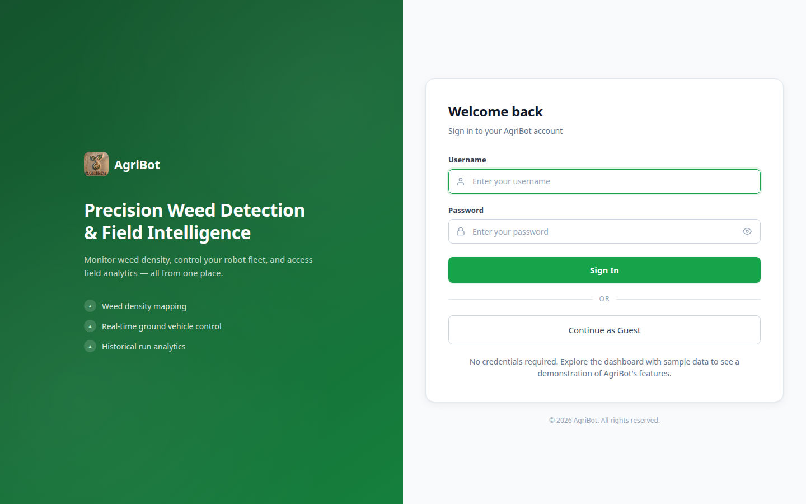
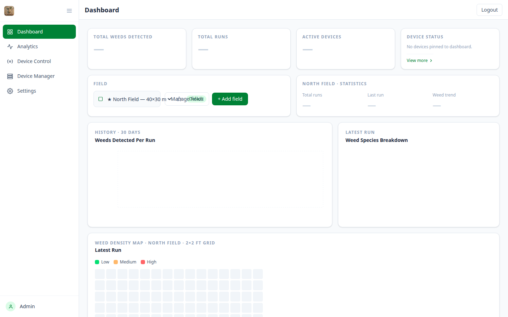
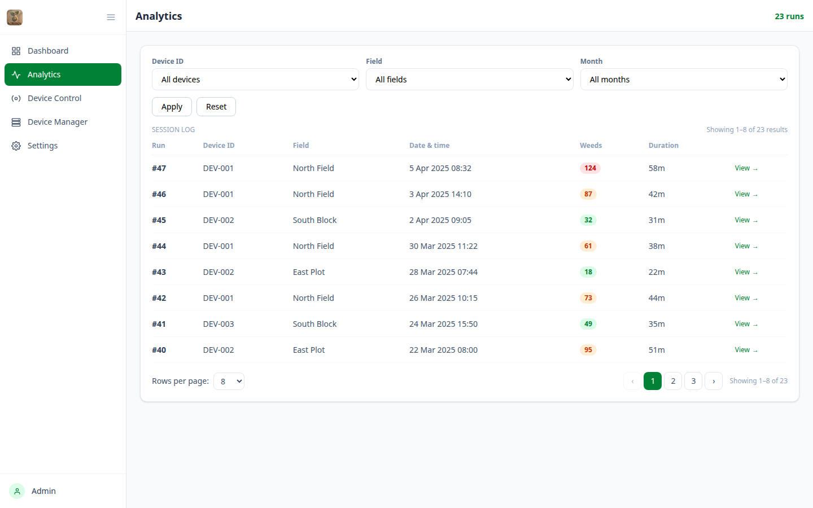
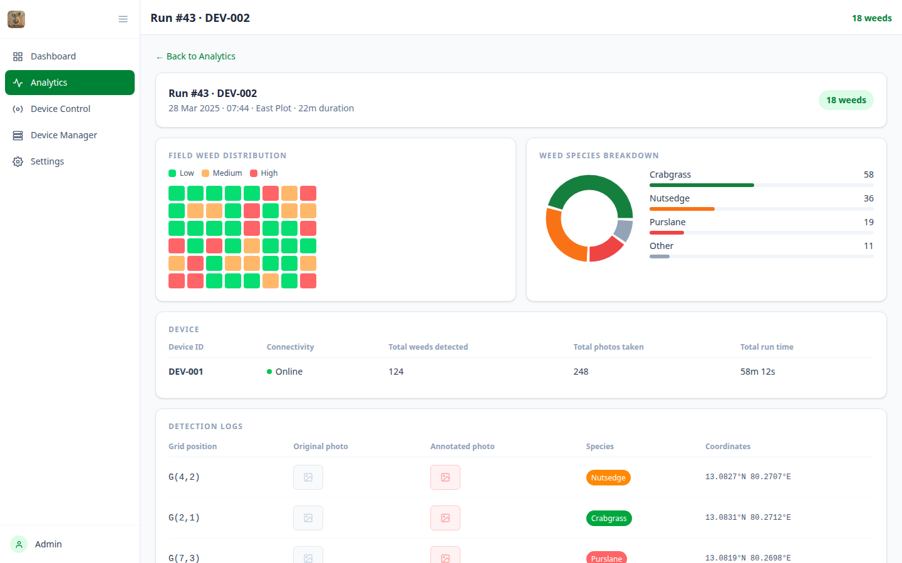
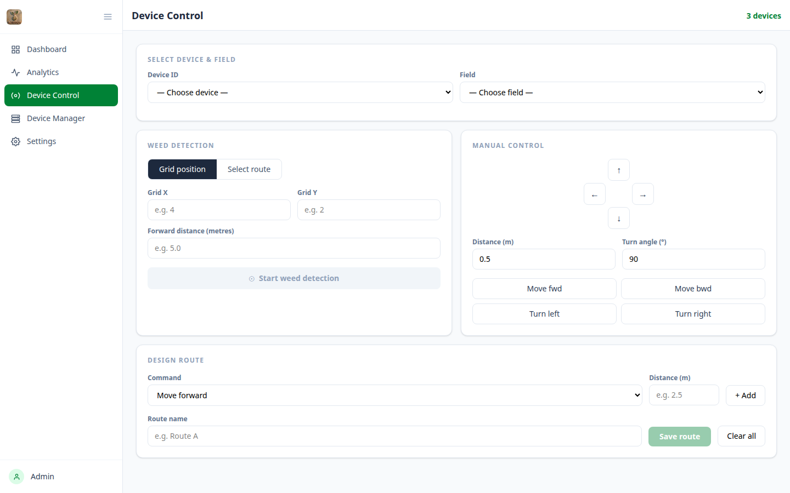
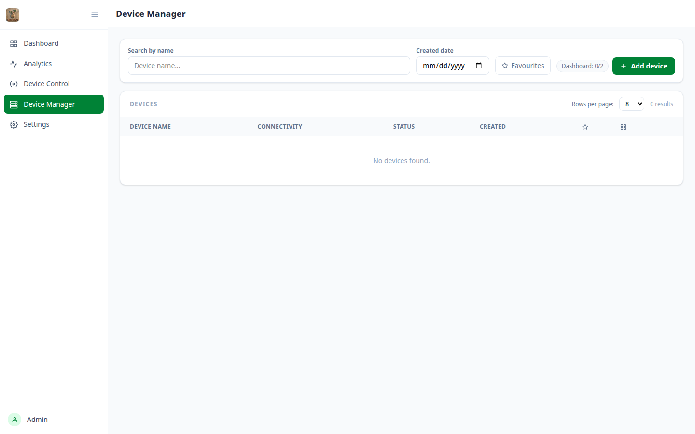
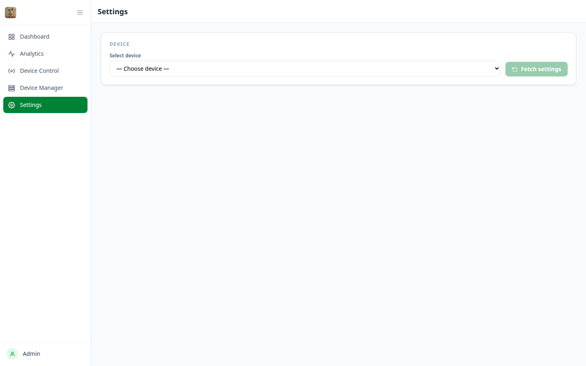

# AgriBot Frontend — Developer Reference

> **Purpose:** Reference material for developers building the AgriBot REST API server. Each section maps a frontend page to the API endpoints it calls, the data shapes it expects, and the UI behaviour it drives.

---

## Table of Contents

1. [Project Overview](#1-project-overview)
2. [Tech Stack](#2-tech-stack)
3. [Application Architecture](#3-application-architecture)
4. [API Client](#4-api-client)
5. [Pages](#5-pages)
   - [Login](#51-login)
   - [Dashboard](#52-dashboard)
   - [Analytics](#53-analytics)
   - [Run Detail](#54-run-detail)
   - [Device Control](#55-device-control)
   - [Device Manager](#56-device-manager)
   - [Settings](#57-settings)
6. [Complete API Endpoint Reference](#6-complete-api-endpoint-reference)
7. [Data Models](#7-data-models)
8. [Polling & Real-time Patterns](#8-polling--real-time-patterns)
9. [LocalStorage Keys](#9-localstorage-keys)

---

## 1. Project Overview

AgriBot is a **precision weed detection** platform. Autonomous robots ("devices") scan agricultural fields in a grid or along pre-defined routes, photograph weeds, and send detection data to the server. This React frontend provides:

- A **live dashboard** with field-level weed metrics and maps
- **Analytics** for reviewing historical detection runs
- A **device control panel** to start/stop detection and manually drive a robot
- **Device management** to register, configure and monitor devices
- **Settings** to push configuration changes to a device

---

## 2. Tech Stack

| Concern | Library / Version |
|---|---|
| UI framework | React 19 |
| Routing | React Router 7 |
| Build tool | Vite 8 |
| Styling | Tailwind CSS 4 |
| Charts | Recharts 3 |
| HTTP | native `fetch` (no axios) |
| State | React `useState` only — no Redux/Context |
| Auth persistence | `localStorage` |

---

## 3. Application Architecture

### 3.1 Routing

**File:** `src/App.jsx`

| Route | Component | Auth required |
|---|---|---|
| `/login` | `Login` | No |
| `/dashboard` | `Dashboard` | Yes |
| `/analytics` | `Analytics` | Yes |
| `/analytics/:runId` | `RunDetail` | Yes |
| `/control` | `DeviceControl` | Yes |
| `/device-manager` | `DeviceManager` | Yes |
| `/settings` | `Settings` | Yes |
| `*` | Redirect to `/login` | — |

**Auth guard:** `PrivateRoute` checks `localStorage.getItem('access_token')`. If absent the user is redirected to `/login`.

### 3.2 Directory Structure

```
src/
├── App.jsx                 # Router + PrivateRoute guard
├── main.jsx                # React entry point
├── pages/
│   ├── Login.jsx
│   ├── Dashboard.jsx
│   ├── Analytics.jsx
│   ├── RunDetail.jsx
│   ├── DeviceControl.jsx
│   ├── DeviceManager.jsx
│   └── Settings.jsx
├── components/
│   ├── Sidebar.jsx         # Collapsible nav sidebar
│   └── AgribotLogo.jsx     # Logo with configurable size/colour
└── services/
    └── api.js              # All API calls (single source of truth)
```

### 3.3 Sidebar Navigation

**File:** `src/components/Sidebar.jsx`

Links: Dashboard → Analytics → Device Control → Device Manager → Settings. Collapses to icon-only on mobile. Includes a logout button that calls `POST /api/auth/logout`.

---

## 4. API Client

**File:** `src/services/api.js`

### Base URL

```
VITE_API_BASE_URL  (env var, defaults to http://localhost:5000)
```

Set `VITE_API_BASE_URL` in `.env` to point at your server.

### Authentication

Every request (except login) attaches a Bearer token:

```http
Authorization: Bearer <access_token>
Content-Type: application/json
```

The token is read from `localStorage.access_token`.

### Core Request Function

```js
async function request(method, path, body) {
  const res = await fetch(`${BASE_URL}${path}`, {
    method,
    headers: authHeaders(),
    ...(body !== undefined ? { body: JSON.stringify(body) } : {}),
  });
  const data = await res.json();
  if (!res.ok) throw new Error(data.message || 'Request failed');
  return data;
}
```

**Error contract:** The server must return JSON with a `message` field when the response is not 2xx, e.g. `{ "message": "Device not found" }`.

---

## 5. Pages

---

### 5.1 Login

**File:** `src/pages/Login.jsx`
**Route:** `/login`



#### Functionality

The entry point of the application. Users authenticate with a username and password. A **Guest Login** button is also available for quick access with pre-filled demo credentials. On success the `access_token` from the response is stored in `localStorage` and the user is redirected to `/dashboard`.

#### API Endpoints

| Method | Endpoint | Trigger | Request Body |
|---|---|---|---|
| `POST` | `/api/auth/login` | Form submit or Guest Login button | `{ "username": "string", "password": "string" }` |

**Expected response:**

```json
{
  "access_token": "eyJhbGci..."
}
```

The token is stored in `localStorage.access_token` immediately after receiving it.

#### Error Handling

If the server returns a non-2xx status the error `message` is displayed as an inline alert beneath the form.

---

### 5.2 Dashboard

**File:** `src/pages/Dashboard.jsx`
**Route:** `/dashboard`



#### Functionality

The main overview screen. It is divided into:

- **Top metrics bar** — total weeds detected, total runs, active/total devices
- **Field selector** — dropdown of fields; supports starring a default and bookmarking favourites (persisted to `localStorage`)
- **Weed trend line chart** — weed counts over the selected time period (30 d default)
- **Species breakdown pie chart** — proportion of each weed species in the latest run for the selected field
- **Weed density map** — colour-coded grid showing weed concentration per cell in the latest run
- **Pinned devices panel** — up to 2 devices can be pinned; their online/working status is polled every 30 s
- **Field management modal** — create or delete fields

All dashboard data refreshes when the selected field changes.

#### API Endpoints

| Method | Endpoint | Query Params | Purpose |
|---|---|---|---|
| `GET` | `/api/auth/me` | — | Verify session on page load; redirect to login if token is invalid |
| `GET` | `/api/fields` | — | Populate field selector dropdown |
| `POST` | `/api/fields` | — | Create a new field (from modal) |
| `DELETE` | `/api/fields/{id}` | — | Delete a field (from modal) |
| `GET` | `/api/devices` | — | Fetch all devices; polled every **30 s** |
| `GET` | `/api/dashboard/metrics` | `field_id` (optional) | Top metrics bar numbers |
| `GET` | `/api/dashboard/runs-chart` | `field_id` (optional), `period` (`30d` default) | Data for weed trend line chart |
| `GET` | `/api/dashboard/species-breakdown` | `field_id` (optional), `run_id=latest` | Data for species pie chart |
| `GET` | `/api/dashboard/density-map` | `field_id` (optional), `run_id=latest` | 2-D grid for density map |
| `POST` | `/api/auth/logout` | — | Logout button in sidebar |

**Expected response shapes:**

```json
// GET /api/dashboard/metrics
{ "total_weeds": 245, "total_runs": 18, "active_devices": 1, "total_devices": 2 }

// GET /api/dashboard/runs-chart
[{ "date": "2024-01-01", "runs": 2 }, ...]

// GET /api/dashboard/species-breakdown
[{ "species": "Dandelion", "count": 120 }, { "species": "Thistle", "count": 80 }]

// GET /api/dashboard/density-map
[[0, 1, 2], [1, 0, 3], [2, 1, 0]]   // 2-D array; value = weed count per cell

// GET /api/fields
[{ "id": 1, "name": "Field A", "width": 10, "height": 8 }]

// POST /api/fields  (request body)
{ "name": "Field B", "width": 12, "height": 10, "partition_type": "grid", "partition_count": 24 }

// GET /api/devices
[{ "id": 1, "name": "AgriBot-01", "device_id": "AB01", "status": "online", "working": false }]
```

---

### 5.3 Analytics

**File:** `src/pages/Analytics.jsx`
**Route:** `/analytics`



#### Functionality

Paginated history of all detection runs. Provides filter controls for:

- **Device** — dropdown of all devices
- **Field** — dropdown of all fields
- **Month** — month picker

Each row in the run table shows run ID, device, field, start time, duration, and total weeds detected. Clicking a row navigates to `/analytics/:runId`.

Active filters are shown as dismissible chips. Pagination is 8 runs per page.

#### API Endpoints

| Method | Endpoint | Query Params | Purpose |
|---|---|---|---|
| `GET` | `/api/runs` | `device_id`, `field_id`, `month`, `page` (default 1), `limit` (default 8) | Paginated run list |
| `GET` | `/api/fields` | — | Populate field filter dropdown |
| `GET` | `/api/devices` | — | Populate device filter dropdown |

**Expected response shape:**

```json
// GET /api/runs
{
  "total": 42,
  "runs": [
    {
      "id": 1,
      "device_id": "AB01",
      "field_id": 1,
      "started_at": "2024-01-01T09:00:00Z",
      "finished_at": "2024-01-01T09:45:00Z",
      "total_weeds": 50
    }
  ]
}
```

---

### 5.4 Run Detail

**File:** `src/pages/RunDetail.jsx`
**Route:** `/analytics/:runId`



#### Functionality

Deep-dive view for a single detection run, shown after clicking a row in Analytics. Contains four panels:

1. **Run summary header** — run ID, device, field, start/end timestamps, total weeds
2. **Weed density map** — colour-coded grid for this specific run
3. **Species breakdown chart** — bar/pie chart of species detected in this run
4. **Device summary table** — connectivity, total photos taken, run duration
5. **Detection log table** — paginated list of every individual weed detection (10 per page) with timestamp, species, confidence score, and grid cell

All data is fetched in parallel on mount using `Promise.allSettled`.

#### API Endpoints

| Method | Endpoint | Query Params | Purpose |
|---|---|---|---|
| `GET` | `/api/runs/{runId}` | — | Run metadata (timestamps, device, field) |
| `GET` | `/api/runs/{runId}/density-map` | — | 2-D grid for this run |
| `GET` | `/api/runs/{runId}/species` | — | Species breakdown for this run |
| `GET` | `/api/runs/{runId}/device-summary` | — | Device stats for this run |
| `GET` | `/api/runs/{runId}/detection-logs` | `page` (default 1), `limit` (default 10) | Paginated detection events |

**Expected response shapes:**

```json
// GET /api/runs/{runId}
{
  "id": 1,
  "device_id": "AB01",
  "field_id": 1,
  "started_at": "2024-01-01T09:00:00Z",
  "finished_at": "2024-01-01T09:45:00Z",
  "total_weeds": 50
}

// GET /api/runs/{runId}/species
[{ "species": "Dandelion", "count": 30 }, { "species": "Thistle", "count": 20 }]

// GET /api/runs/{runId}/density-map
[[0, 1, 2], [1, 0, 3]]

// GET /api/runs/{runId}/device-summary
{
  "device_id": "AB01",
  "connectivity": "good",
  "total_weeds": 50,
  "total_photos": 120,
  "run_time": "00:45:00"
}

// GET /api/runs/{runId}/detection-logs
{
  "total": 120,
  "logs": [
    {
      "id": 1,
      "timestamp": "2024-01-01T09:05:00Z",
      "species": "Dandelion",
      "confidence": 0.95,
      "cell": "A3"
    }
  ]
}
```

---

### 5.5 Device Control

**File:** `src/pages/DeviceControl.jsx`
**Route:** `/control`



#### Functionality

Operator console for running detection sessions and manually driving a device. The page has two major modes:

**Detection Mode**
1. Select a device and a field
2. Choose detection mode: **Grid** (specify grid dimensions X × Y and cell distance) or **Route** (select a saved route)
3. Press **Start Detection** — robot begins scanning
4. Live detection grid updates every **3.5 s**, showing which cells have been scanned and how many weeds were found
5. Status bar (cells scanned / total, weeds found) updates every **2 s**
6. Press **Stop** to halt the run

**Manual Control Mode**
- D-pad (Forward / Backward / Left / Right) sends individual move commands
- Each button press calls the move endpoint with a configurable distance/angle value

**Route Designer**
- Create a named sequence of move steps (forward N cm, turn left/right N°, etc.)
- Save the route; it becomes available in the Route detection mode dropdown

#### API Endpoints

| Method | Endpoint | Trigger | Body / Params |
|---|---|---|---|
| `GET` | `/api/devices` | Page load | — |
| `GET` | `/api/fields` | Page load | — |
| `GET` | `/api/routes?device_id={id}` | Device selected | `device_id` query param |
| `POST` | `/api/devices/{id}/detection/start` | Start button | See below |
| `POST` | `/api/devices/{id}/detection/stop` | Stop button | — |
| `GET` | `/api/devices/{id}/detection/status` | Polled every **2 s** during run | — |
| `GET` | `/api/devices/{id}/detection/grid` | Polled every **3.5 s** during run | — |
| `POST` | `/api/devices/{id}/move` | D-pad button press | `{ "command": "forward\|backward\|left\|right", "value": number }` |
| `POST` | `/api/routes` | Save route button | See below |
| `DELETE` | `/api/routes/{id}` | Delete route button | — |

**Start detection request bodies:**

```json
// Grid mode
{
  "mode": "grid",
  "grid_x": 5,
  "grid_y": 4,
  "distance": 100
}

// Route mode
{
  "mode": "route",
  "route_id": 3
}
```

**Detection status response:**

```json
{
  "cells_total": 20,
  "cells_scanned": 7,
  "weeds_found": 12,
  "device_position": "B3",
  "status": "running",     // "running" | "finished" | "stopped"
  "finished_at": null,
  "stopped_at": null
}
```

**Detection grid response:**

```json
[[0, 1, 0], [2, 0, 1], [0, 0, 3]]   // 2-D array; null = unscanned, 0+ = weed count
```

**Route create request body:**

```json
{
  "name": "Perimeter Sweep",
  "device_id": 1,
  "instructions": [
    { "command": "forward", "value": 200 },
    { "command": "left",    "value": 90 },
    { "command": "forward", "value": 200 }
  ]
}
```

---

### 5.6 Device Manager

**File:** `src/pages/DeviceManager.jsx`
**Route:** `/device-manager`



#### Functionality

Fleet management screen for registering and managing robots.

- **Device list** — searchable/filterable table (by name, by registration date, by favourites)
- **Favourite** toggle — stars a device in the list (stored in `localStorage`)
- **Dashboard pin** — pin up to 2 devices to the Dashboard status panel (stored in `localStorage`)
- **Create device** modal — form to register a new robot with all connection parameters; name uniqueness is checked live as the user types
- **Delete device** — confirmation dialog before deletion

#### API Endpoints

| Method | Endpoint | Trigger | Body / Params |
|---|---|---|---|
| `GET` | `/api/devices` | Page load | — |
| `GET` | `/api/devices/check-name?name={name}` | Name field `onChange` (debounced) | `name` query param |
| `POST` | `/api/devices` | Create form submit | See below |
| `DELETE` | `/api/devices/{id}` | Confirm delete button | — |

**Create device request body:**

```json
{
  "name": "AgriBot-02",
  "device_id": "AB02",
  "server_url": "http://192.168.1.11",
  "serial_port": "/dev/ttyUSB0",
  "serial_baud_rate": 115200,
  "camera_index": 0,
  "confidence_threshold": 0.75
}
```

**Check name response:**

```json
{ "available": true }
```

**Devices list response:**

```json
[
  {
    "id": 1,
    "name": "AgriBot-01",
    "device_id": "AB01",
    "server_url": "http://192.168.1.10",
    "status": "online",       // "online" | "offline"
    "working": false,
    "created_at": "2024-01-01T00:00:00Z"
  }
]
```

---

### 5.7 Settings

**File:** `src/pages/Settings.jsx`
**Route:** `/settings`



#### Functionality

Configuration editor for a selected device. The user picks a device from a dropdown; its current settings are fetched and rendered as an editable form. Individual fields can be edited inline. Pressing **Save** pushes the updated configuration back to the device via the API.

#### API Endpoints

| Method | Endpoint | Trigger | Body |
|---|---|---|---|
| `GET` | `/api/devices` | Page load | — |
| `GET` | `/api/devices/{id}/settings` | Device selected | — |
| `PUT` | `/api/devices/{id}/settings` | Save button | Settings object (see below) |

**Settings response / request body:**

```json
{
  "server_url": "http://192.168.1.10",
  "serial_port": "/dev/ttyUSB0",
  "serial_baud_rate": 115200,
  "camera_index": 0,
  "confidence_threshold": 0.70
}
```

---

## 6. Complete API Endpoint Reference

All endpoints are prefixed with the base URL (`VITE_API_BASE_URL`, default `http://localhost:5000`).

### Authentication

| Method | Path | Description |
|---|---|---|
| `POST` | `/api/auth/login` | Login; returns `{ access_token }` |
| `POST` | `/api/auth/logout` | Invalidate session |
| `GET` | `/api/auth/me` | Return current user profile |

### Fields

| Method | Path | Description |
|---|---|---|
| `GET` | `/api/fields` | List all fields |
| `POST` | `/api/fields` | Create field |
| `PUT` | `/api/fields/{id}` | Update field |
| `DELETE` | `/api/fields/{id}` | Delete field |

### Devices

| Method | Path | Description |
|---|---|---|
| `GET` | `/api/devices` | List all devices |
| `GET` | `/api/devices/{id}` | Get single device |
| `GET` | `/api/devices/{id}/ping` | Ping device (connectivity check) |
| `POST` | `/api/devices` | Register new device |
| `DELETE` | `/api/devices/{id}` | Delete device |
| `GET` | `/api/devices/check-name?name=` | Check if device name is available |

### Dashboard

| Method | Path | Query Params | Description |
|---|---|---|---|
| `GET` | `/api/dashboard/metrics` | `field_id` | Aggregate stats |
| `GET` | `/api/dashboard/runs-chart` | `field_id`, `period` | Time-series run data |
| `GET` | `/api/dashboard/species-breakdown` | `field_id`, `run_id` | Species counts |
| `GET` | `/api/dashboard/density-map` | `field_id`, `run_id` | Weed density grid |

### Runs (Analytics)

| Method | Path | Query / Route Params | Description |
|---|---|---|---|
| `GET` | `/api/runs` | `device_id`, `field_id`, `month`, `page`, `limit` | Paginated run list |
| `GET` | `/api/runs/{runId}` | — | Run metadata |
| `GET` | `/api/runs/{runId}/density-map` | — | Density grid for run |
| `GET` | `/api/runs/{runId}/species` | — | Species breakdown for run |
| `GET` | `/api/runs/{runId}/device-summary` | — | Device stats for run |
| `GET` | `/api/runs/{runId}/detection-logs` | `page`, `limit` | Paginated detection events |

### Device Control — Detection

| Method | Path | Description |
|---|---|---|
| `POST` | `/api/devices/{id}/detection/start` | Start a detection run |
| `POST` | `/api/devices/{id}/detection/stop` | Stop the active run |
| `GET` | `/api/devices/{id}/detection/status` | Current run progress & status |
| `GET` | `/api/devices/{id}/detection/grid` | Live detection grid state |

### Device Control — Manual Movement

| Method | Path | Description |
|---|---|---|
| `POST` | `/api/devices/{id}/move` | Send a move command |

### Routes

| Method | Path | Description |
|---|---|---|
| `GET` | `/api/routes?device_id=` | List routes (optionally filter by device) |
| `GET` | `/api/routes/{id}` | Get single route |
| `POST` | `/api/routes` | Create route |
| `PUT` | `/api/routes/{id}` | Update route |
| `DELETE` | `/api/routes/{id}` | Delete route |

### Device Settings

| Method | Path | Description |
|---|---|---|
| `GET` | `/api/devices/{id}/settings` | Fetch current device configuration |
| `PUT` | `/api/devices/{id}/settings` | Push updated configuration to device |

---

## 7. Data Models

### Field

```json
{
  "id": 1,
  "name": "North Paddock",
  "width": 10,
  "height": 8,
  "partition_type": "grid",
  "partition_count": 80,
  "created_at": "2024-01-01T00:00:00Z"
}
```

### Device

```json
{
  "id": 1,
  "name": "AgriBot-01",
  "device_id": "AB01",
  "server_url": "http://192.168.1.10",
  "serial_port": "/dev/ttyUSB0",
  "serial_baud_rate": 115200,
  "camera_index": 0,
  "confidence_threshold": 0.75,
  "status": "online",
  "working": false,
  "created_at": "2024-01-01T00:00:00Z"
}
```

### Run

```json
{
  "id": 1,
  "device_id": "AB01",
  "field_id": 1,
  "mode": "grid",
  "started_at": "2024-01-01T09:00:00Z",
  "finished_at": "2024-01-01T09:45:00Z",
  "total_weeds": 50
}
```

### Detection Log Entry

```json
{
  "id": 1,
  "run_id": 1,
  "timestamp": "2024-01-01T09:05:00Z",
  "species": "Dandelion",
  "confidence": 0.95,
  "cell": "A3",
  "photo_url": "/photos/run1/A3_001.jpg"
}
```

### Route

```json
{
  "id": 1,
  "name": "Perimeter Sweep",
  "device_id": 1,
  "instructions": [
    { "command": "forward", "value": 200 },
    { "command": "left",    "value": 90  },
    { "command": "forward", "value": 200 }
  ],
  "created_at": "2024-01-01T00:00:00Z"
}
```

### Move Command Values

| `command` | `value` unit |
|---|---|
| `forward` | centimetres |
| `backward` | centimetres |
| `left` | degrees |
| `right` | degrees |

---

## 8. Polling & Real-time Patterns

The frontend uses `setInterval`-based polling — there is no WebSocket. The server must be able to handle frequent lightweight requests from active sessions.

| Interval | Endpoint | Page | Purpose |
|---|---|---|---|
| 30 s | `GET /api/devices` | Dashboard | Refresh device online/working status |
| 2 s | `GET /api/devices/{id}/detection/status` | Device Control | Update progress bar (cells scanned, weeds found) |
| 3.5 s | `GET /api/devices/{id}/detection/grid` | Device Control | Refresh live detection grid cells |

Polling stops when:
- The component unmounts (cleanup via `clearInterval`)
- Detection status `status` field is `"finished"` or `"stopped"`

---

## 9. LocalStorage Keys

The frontend uses `localStorage` for auth and user preferences. The REST API server does not interact with these — they are client-side only.

| Key | Type | Description |
|---|---|---|
| `access_token` | `string` | JWT / Bearer token from login |
| `defaultFieldId` | `string` | ID of the user's default field shown on Dashboard |
| `favoriteFieldIds` | `JSON string[]` | Array of field IDs marked as favourites |
| `dashboardDeviceIds` | `JSON string[]` | Up to 2 device IDs pinned to Dashboard |
| `favoriteDeviceIds` | `JSON string[]` | Array of device IDs marked as favourites |

---

*Generated from source: `src/services/api.js`, `src/App.jsx`, `src/pages/*`*
